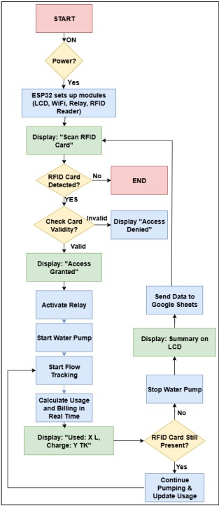

# 💧 RFID-Enabled Smart Water Dispensing System  

An IoT-based dual-tap smart water dispensing system using **ESP32** and **RFID authentication**, with **real-time billing** and **cloud logging** to Firebase via Google Apps Script. This project ensures **fair, transparent, and scalable water management**, suitable for communities and public utilities.  

---

## 📹 Demo Video  
▶️ [Watch on YouTube](https://youtu.be/fLDw5V6l8GA)  

---

## 📂 Repository  
GitHub Project Link: [IoT Project — Water Dispensing System](https://github.com/SharunTawsif/Iot-project-water-dispensing-system-)  

---

## ⚡ Features  
- 🔑 **RFID-based authentication** for secure water access  
- 🚰 **Dual-tap concurrency** — two users can dispense water simultaneously  
- ⏱️ **Per-second billing** (3 TK/s, 10 ml/s) with buzzer feedback  
- ☁️ **Cloud integration** using Google Apps Script + Firebase RTDB  
- 📊 **Web dashboard** for real-time monitoring of sessions and usage  
- 🔋 **Low-cost, portable prototype** powered by a 7.7V battery + MP1584 buck converter  

---

## 🛠️ Hardware Components  
- ESP32 Wi-Fi Microcontroller  
- 2 × RDM6300 RFID Readers  
- 2 × Mini DC Water Pumps  
- Buzzer (for per-second feedback)  
- MP1584 Buck Converter (7.7V → 5V regulation)  
- Transistors + Resistors (for pump/buzzer interfacing)  
- Control Switches for manual override  

---

## 🧑‍💻 Software and Cloud Stack  
- **Firmware:** Arduino C++ (FreeRTOS for dual-core task management)  
- **Communication Protocol:** HTTPS GET requests  
- **Backend:** Google Apps Script (session handler + Firebase logging)  
- **Database:** Firebase Realtime Database (sessions + logs)  
- **Visualization:** Web dashboard using Firebase SDK  

---

## 🔄 System Workflow  
1. User scans RFID card.  
2. ESP32 validates card and balance.  
3. Pump activates while card is present.  
4. Per-second billing deducted from balance.  
5. Session logged to Firebase via Apps Script.  
6. Admin monitors usage on the website.  

---

## 📊 Sample Experimental Results  

| Reader | Card ID   | Time (s) | Water (ml) | Bill (TK) | Remaining Balance |
|--------|-----------|----------|------------|-----------|-------------------|
| One    | 99035899  | 2        | 20         | 6         | 797               |
| One    | 99035899  | 3        | 30         | 9         | 791               |
| Two    | 98096921  | 1        | 10         | 3         | 1200              |
| Two    | 98096921  | 7        | 70         | 21        | 1182              |
| Two    | 98096921  | 10       | 100        | 30        | 1155              |

---

## 📐 System Architecture  

  

---

## 📈 Flowchart  

  

---

## 🚀 Future Work  
- Flow sensors for **accurate volume-based billing**  
- Mobile app for **balance recharge & history**  
- Stronger **TLS & security rules** in Firebase  
- **Solar-powered deployment** for rural/off-grid areas  
- Field testing in **large-scale community setups**  

---

## 👥 Contributors  

1. **Sadman Salman Saad** — 20210104114  
2. **Abdullah Al Maruf** — 20210104116  
3. **Sharun Tawsif** — 20210104124  
4. **Nafisa Tabassum Shouty** — 20210104127  

---

## 📌 Submitted To  

**Mr. Mustofa Ahmed**  
**Ms. Nusrat Jahan**  

---

## 📜 License  
This project is licensed under the MIT License.  
